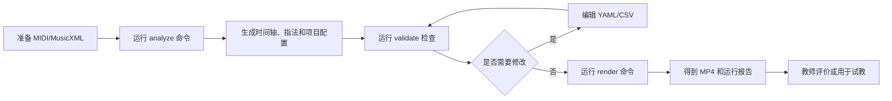

# 钢琴乐谱到虚拟手教学视频：产品需求文档（PRD）

## 1. 文档信息

| 项目 | 内容 |
|---|---|
| 产品名称 | Piano Hand（暂定） |
| 文档版本 | 0.1 |
| 产品阶段 | 需求验证型 MVP |
| 使用形态 | 本地命令行工具，无 UI |
| 核心输入 | MIDI、MusicXML |
| 核心输出 | 虚拟手钢琴教学 MP4、指法与时间轴文件 |
| 参考文档 | [MVP方案.md](./MVP方案.md)、[deep-research-report.md](./deep-research-report.md) |

## 2. 产品背景

已有钢琴学习产品大量采用瀑布流、按键高亮、课程和实时评分，但教师仍缺少一种低成本工具，把自己的数字乐谱快速转换成包含左右手、手指和手位信息的教学视频。

真人录制能够展示真实动作，但存在准备时间长、错误后需要重录、难以批量生成不同速度版本等问题。本产品首先验证一种更可控的方案：将符号乐谱转换为结构化指法和示意手动画。

## 3. 产品目标

### 3.1 业务目标

- 验证钢琴教师与教学创作者对自动生成手部教学视频的真实需求。
- 验证“虚拟手示意 + 可编辑指法”是否能产生区别于瀑布流的教学价值。
- 验证数字乐谱到教学视频是否可以显著降低内容制作时间。

### 3.2 用户目标

- 使用自己的 MIDI/MusicXML 生成教学视频。
- 清楚看到每个音符由哪只手、哪根手指按下。
- 修改错误或不符合个人教学习惯的指法。
- 快速生成不同速度或不同练习片段的视频。

### 3.3 非目标

- 不提供完整线上学琴课程。
- 不评价学生演奏是否正确。
- 不代替专业教师给出唯一正确指法。
- 不保证所有复杂钢琴作品均可生成自然动作。
- 不提供商业级云端服务与高并发处理。

## 4. 用户角色

### 4.1 钢琴教师

主要诉求：

- 为学生生成课后练习视频。
- 修改系统指法，使其符合教学方案。
- 输出慢速、分段或单手练习版本。

成功标准：

- 不需要掌握视频剪辑软件。
- 生成和修改过程比真人录制更快。
- 视频能够让学生辨认按键和手指。

### 4.2 教学内容创作者

主要诉求：

- 批量生产统一风格的示范素材。
- 对同一曲目生成多个速度版本。
- 获得可进一步剪辑的 MP4。

### 4.3 内部测试与算法人员

主要诉求：

- 查看标准化音符、指法和动作时间轴。
- 定位解析失败、指法异常和渲染错误。
- 对不同算法输出做可重复比较。

## 5. 使用前提

- 用户能够提供合法使用的 MIDI 或 MusicXML 文件。
- 用户能够运行本地命令行命令。
- 环境已安装 Python、FFmpeg 和配置好的钢琴音色。
- 本 MVP 面向内部测试和受控教师试用，不面向普通消费者直接发布。

## 6. 核心用户流程



## 7. 功能需求

需求编号格式：

- `IMP`：输入与解析。
- `PLAN`：左右手与指法规划。
- `EDIT`：人工编辑。
- `REN`：视频渲染。
- `VAL`：质量校验。
- `EXP`：输出。

### 7.1 输入与解析

#### IMP-001 导入 MIDI

系统必须能够读取标准 `.mid` 和 `.midi` 文件。

验收标准：

- 能读取 note-on、note-off、速度、力度和踏板事件。
- 多轨 MIDI 能被合并到统一时间轴，并保留原始轨道标识。
- 文件损坏或不支持时给出明确错误，不能无提示退出。

#### IMP-002 导入 MusicXML

系统必须能够读取 `.musicxml`、`.xml` 和压缩 `.mxl` 文件。

验收标准：

- 能读取音高、时值、小节、拍号、速度、声部和谱表。
- 若原谱包含指法，优先保留并标记来源。
- 能处理休止符、和弦和跨小节延音。

#### IMP-003 标准化事件模型

系统必须把不同输入转换为统一音符事件。

每个音符至少包含：

- 唯一 ID。
- 音高与 MIDI 音高编号。
- 起始拍点与起始秒。
- 时值拍数与持续秒数。
- 小节、声部、谱表。
- 左右手。
- 指法。
- 力度和踏板上下文。
- 数据来源与置信度。

### 7.2 左右手与指法规划

#### PLAN-001 左右手分配

分配优先级：

1. 用户人工配置。
2. MusicXML 谱表或已有标记。
3. MIDI 原始轨道信息。
4. 基于音域、连续性、同时音和手跨度的规则推断。

验收标准：

- 每个可演奏音符必须被分配为左手或右手。
- 分配置信度过低时必须产生警告。
- 同一时间超过单手合理跨度时必须产生警告。

#### PLAN-002 自动指法

系统必须为每只手的音符生成 1–5 指编号：

- 右手：1 为拇指，5 为小指。
- 左手：1 为拇指，5 为小指。

验收标准：

- 所有非忽略音符具有合法指号。
- 同时和弦不能让同一只手的同一根手指按两个不同键。
- 明显超过配置手跨度的方案必须被标记。
- 指法来源必须区分 `score`、`generated` 和 `manual`。

#### PLAN-003 指法可解释信息

系统应为自动指法输出简短原因或代价项，例如：

- 保持当前手位。
- 发生拇指穿越。
- 减少大跳。
- 和弦按键顺序。
- 保留谱面已有指法。

该信息主要用于调试和用户访谈，不要求生成自然语言教学讲解。

### 7.3 人工编辑

#### EDIT-001 项目配置

`analyze` 命令必须生成一个可读的 YAML 项目文件。

用户可以修改：

- 输入文件路径。
- 目标 BPM 或速度倍率。
- 起止小节。
- 分辨率和帧率。
- 显示选项。
- 音色路径。
- 指法覆盖文件路径。

#### EDIT-002 指法表

系统必须导出 CSV 指法表，至少包含：

```text
note_id,measure,onset,pitch,hand,finger,source,confidence
```

用户修改 `hand` 或 `finger` 后，系统必须能够重新加载。

#### EDIT-003 覆盖优先级

人工修改必须高于原谱指法和自动生成结果。重新运行渲染时，不得覆盖人工修改。

#### EDIT-004 配置错误提示

以下情况必须阻止渲染并指出具体行或音符：

- 指号不在 1–5 范围内。
- 手的值不是 `left` 或 `right`。
- 引用了不存在的音符 ID。
- 起止小节超出乐谱范围。
- 输出路径不可写。

### 7.4 动画与视频

#### REN-001 虚拟键盘

系统必须绘制覆盖当前曲目音域的钢琴键盘，并至少额外显示左右各两个键作为位置上下文。

验收标准：

- 黑白键位置与 MIDI 音高映射正确。
- 被按下的键能够高亮。
- 左右手使用不同且稳定的颜色。

#### REN-002 虚拟手

系统必须显示两只二维或 2.5D 示意手。

最低要求：

- 能区分左右手。
- 能区分五根手指。
- 当前按键手指与目标琴键接触。
- 手指上方或附近可显示 1–5 编号。
- 音符之间使用平滑插值，避免逐帧跳变。

> MVP 的虚拟手是教学示意，不要求满足完整人体解剖或真实物理运动。

#### REN-003 时间同步

- 按键高亮、指尖接触和音频 note-on 应来自同一个事件时间轴。
- note-off 时按键恢复，手指可根据下一动作提前移动。
- 音视频总时长差异不得超过 100 毫秒。

#### REN-004 视频模板

P0 默认模板必须包含：

- 深色或浅色纯色背景。
- 横向键盘。
- 左右手颜色图例。
- 当前小节与速度。
- 手指编号。

P0 只要求一种稳定的俯视模板。

#### REN-005 调速与片段

用户可以：

- 指定 BPM。
- 指定速度倍率。
- 指定起止小节。
- 在片段前添加固定预备拍。

#### REN-006 音频

- 默认使用 MIDI 和指定 SoundFont 合成音频。
- 合成失败时必须终止最终 MP4 输出并给出原因。
- 不允许生成看似成功但没有音轨的最终视频，除非用户显式设置静音模式。

### 7.5 校验与报告

#### VAL-001 渲染前校验

校验内容至少包括：

- 输入文件可读。
- 音符事件非空。
- 所有音符具有左右手与合法指法。
- 同时音不存在明显的手指冲突。
- 配置引用有效。
- FFmpeg 和 SoundFont 可用。

#### VAL-002 教学风险警告

以下问题不一定阻止渲染，但必须写入报告：

- 手跨度过大。
- 单手短时间内跨越过远。
- 连续重复音指法不合理。
- 左右手频繁交叉。
- 自动分手置信度较低。
- 原谱指法与自动规则冲突。

#### VAL-003 运行报告

系统必须输出 JSON 报告，包含：

- 输入摘要。
- 曲目长度、音符数和音域。
- 自动与人工指法数量。
- 警告和错误。
- 各阶段耗时。
- 视频和音频时长。
- 软件版本与配置摘要。

### 7.6 输出

#### EXP-001 MP4

默认输出要求：

- H.264 MP4。
- 1280×720。
- 30 FPS。
- AAC 音频。
- 文件可被常见播放器正常播放。

#### EXP-002 结构化文件

每个项目必须保留下列文件：

- `project.yaml`
- `timeline.json`
- `fingering.csv`
- `validation-report.json`
- `output.mp4`

#### EXP-003 可重复生成

相同输入、配置、随机种子和软件版本应产生语义一致的时间轴与指法结果。视频编码产生的二进制差异不作为失败。

## 8. CLI 产品接口

### 8.1 分析

```bash
piano-hand analyze <input-file> --output <project-directory>
```

作用：

- 解析乐谱。
- 生成左右手和指法。
- 输出项目配置及中间文件。
- 执行基础校验。

### 8.2 校验

```bash
piano-hand validate <project.yaml>
```

作用：

- 加载用户修改。
- 检查配置、指法和依赖。
- 输出错误及警告。

### 8.3 渲染

```bash
piano-hand render <project.yaml>
```

作用：

- 生成动画帧和音频。
- 合成为 MP4。
- 输出运行报告。

### 8.4 全流程快捷命令

```bash
piano-hand build <input-file> --output <project-directory>
```

作用：完成默认分析、校验和渲染，适合首次体验。

## 9. 非功能需求

### 9.1 易用性

- 安装和首次运行说明应能让具备基础命令行经验的用户在 30 分钟内生成示例视频。
- 所有错误信息应包含原因和建议动作。
- 配置文件必须带注释或配套字段说明。

### 9.2 性能

参考开发环境为 8 核 CPU、16GB 内存、无独立 GPU：

- 3 分钟、720p、30 FPS 的视频目标渲染时间不超过 10 分钟。
- `analyze` 阶段目标耗时不超过 30 秒。
- 峰值内存目标不超过 4GB。

性能目标用于 MVP 验收，可根据实际渲染方案调整，但必须记录基准。

### 9.3 稳定性

- 单个项目失败不得破坏输入文件。
- 临时文件必须写入项目内的独立临时目录。
- 中断后可以重新运行，不要求断点续渲染。

### 9.4 版权与隐私

- 示例乐谱、SoundFont 和测试音频必须确认许可证。
- 运行报告不得上传用户文件或曲目信息。
- MVP 默认完全本地运行，不收集个人数据。
- 输出视频建议标注“系统生成教学可视化”。

## 10. 数据与反馈记录

由于没有 UI 和在线埋点，测试阶段使用本地报告与访谈表记录：

- 输入类型和曲目难度。
- 首次生成是否成功。
- 用户修改的指法数量。
- 从导入到可用视频的时间。
- 用户认为最有价值和最不可接受的部分。
- 是否愿意用于真实教学。
- 是否愿意继续试用。

不得把“视频成功生成”直接视为产品需求成立。

## 11. 发布与验收范围

### 11.1 Alpha 内部版

- 支持固定测试样本。
- 跑通完整命令链路。
- 允许算法和渲染人员检查中间结果。

### 11.2 教师试用版

- 支持外部用户提供的合法 MIDI/MusicXML。
- 具有安装说明、示例和错误排查说明。
- 通过本 PRD 的 P0 验收项。

## 12. 产品级完成定义

MVP 产品完成必须同时满足：

- 完整支持 MIDI 和 MusicXML 两类输入。
- 用户无需改代码即可修改指法和速度。
- 能稳定输出带音频的 MP4。
- 有明确校验报告，不能静默接受错误指法。
- 20 首测试样本成功生成率达到 90%。
- 至少完成 5 名目标用户的受控试用。
- 根据指标形成继续、调整或停止的书面结论。

