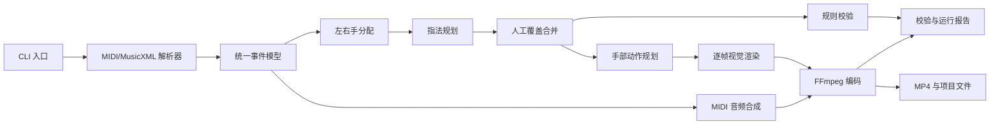

# 钢琴乐谱到虚拟手教学视频：开发技术需求文档

## 1. 文档范围

本文档定义无 UI、完全本地运行的验证型 MVP 技术方案。目标是以最少系统组件实现：

```text
MIDI/MusicXML
→ 标准化事件
→ 左右手与指法
→ 可人工覆盖的动作计划
→ 虚拟键盘和示意手动画
→ 同步音频 MP4
```

关联文档：

- [MVP方案.md](./MVP方案.md)
- [产品需求文档_PRD.md](./产品需求文档_PRD.md)
- [deep-research-report.md](./deep-research-report.md)

## 2. 技术设计原则

1. **验证优先**：不建设服务端、数据库、前端和账号体系。
2. **结构化优先**：所有生成步骤保留可检查的中间数据。
3. **可编辑优先**：人工配置永远可以覆盖自动结果。
4. **确定性优先**：同一输入和配置应得到可重复结果。
5. **模块化但不微服务化**：单个 Python 包内按职责拆分模块。
6. **教学清晰优先**：动作清楚、同步正确高于视觉逼真。
7. **许可证可控**：只引入适合当前验证方式的依赖与资产。

## 3. 推荐技术栈

| 分类 | 推荐方案 | 用途 |
|---|---|---|
| 语言 | Python 3.11 | 主开发语言 |
| CLI | Typer | 命令、参数和帮助信息 |
| 配置与模型 | Pydantic 2、PyYAML | 数据校验与 YAML 配置 |
| MIDI | pretty_midi、mido | MIDI 解析与事件处理 |
| MusicXML | music21 | MusicXML/MXL 解析 |
| 数值计算 | NumPy | 坐标、插值和代价计算 |
| 图像渲染 | OpenCV 或 Pillow | 键盘、文字和手部骨架绘制 |
| 音频合成 | FluidSynth + 合法 SoundFont | MIDI 到 WAV |
| 视频编码 | FFmpeg | 帧、音频到 MP4 |
| 测试 | pytest、pytest-cov | 单元与集成测试 |
| 质量工具 | Ruff、mypy | 格式、静态检查 |

`partitura` 可以作为后续对复杂 MusicXML 或符号对齐能力的增强依赖，不作为第一版必须依赖。

## 4. 系统边界

### 4.1 系统内

- 本地文件输入。
- 乐谱解析与统一事件模型。
- 指法和左右手规划。
- YAML/CSV 人工覆盖。
- 示意手动作规划。
- 离线音频与视频渲染。
- 本地质量报告。

### 4.2 系统外

- 乐谱版权校验。
- 云端存储和计算。
- 用户管理和鉴权。
- 在线支付。
- 课程管理。
- 学生演奏采集与评分。
- PDF/图片 OMR。

## 5. 总体架构



## 6. 建议代码结构

```text
piano_hand/
├── __init__.py
├── cli.py
├── config.py
├── models/
│   ├── note.py
│   ├── score.py
│   ├── fingering.py
│   ├── motion.py
│   └── report.py
├── parsers/
│   ├── midi_parser.py
│   ├── musicxml_parser.py
│   └── normalizer.py
├── planning/
│   ├── hand_assignment.py
│   ├── fingering_dp.py
│   ├── fingering_rules.py
│   └── overrides.py
├── motion/
│   ├── keyboard_geometry.py
│   ├── hand_pose.py
│   ├── trajectory.py
│   └── interpolation.py
├── rendering/
│   ├── frame_renderer.py
│   ├── overlays.py
│   ├── audio_renderer.py
│   └── video_encoder.py
├── validation/
│   ├── score_checks.py
│   ├── fingering_checks.py
│   ├── media_checks.py
│   └── report_builder.py
└── io/
    ├── project_files.py
    ├── csv_io.py
    └── json_io.py

tests/
├── fixtures/
├── unit/
├── integration/
└── golden/
```

## 7. 核心数据模型

### 7.1 NoteEvent

```json
{
  "id": "m12-v1-n0042",
  "pitch": 64,
  "pitch_name": "E4",
  "onset_beat": 44.0,
  "duration_beat": 1.0,
  "onset_sec": 31.428,
  "duration_sec": 0.714,
  "measure": 12,
  "voice": "1",
  "staff": 1,
  "track": 0,
  "velocity": 72,
  "hand": "right",
  "hand_confidence": 1.0,
  "finger": 3,
  "finger_source": "manual",
  "finger_confidence": 1.0,
  "pedal_down": false
}
```

约束：

- `pitch` 范围为 0–127。
- `duration_beat` 和 `duration_sec` 必须大于 0。
- `hand` 为 `left`、`right` 或分析阶段临时使用的 `unknown`。
- 最终渲染前 `hand` 不得为 `unknown`。
- `finger` 最终必须为 1–5。

### 7.2 ScoreTimeline

```json
{
  "schema_version": "1.0",
  "source": {
    "path": "song.musicxml",
    "type": "musicxml",
    "sha256": "..."
  },
  "tempo_map": [
    {"beat": 0.0, "bpm": 84.0}
  ],
  "time_signatures": [
    {"measure": 1, "numerator": 4, "denominator": 4}
  ],
  "notes": [],
  "pedal_events": [],
  "duration_sec": 180.0
}
```

### 7.3 ProjectConfig

```yaml
schema_version: "1.0"
input:
  path: "./source.musicxml"
  type: "auto"

timeline:
  path: "./timeline.json"
  fingering_overrides: "./fingering.csv"

playback:
  tempo_mode: multiplier
  tempo_value: 0.75
  start_measure: 1
  end_measure: null
  count_in_beats: 4

render:
  width: 1280
  height: 720
  fps: 30
  theme: dark
  show_finger_numbers: true
  show_measure: true
  show_note_names: false
  random_seed: 0

audio:
  enabled: true
  soundfont_path: "./assets/piano.sf2"
  sample_rate: 48000

output:
  video_path: "./output.mp4"
  report_path: "./validation-report.json"
```

### 7.4 MotionFrame

渲染器不要求永久保存全部帧数据，但动作规划器必须能够按时间查询：

```json
{
  "time_sec": 31.428,
  "left": {
    "wrist": [210.0, 240.0],
    "fingers": {
      "1": [[220.0, 245.0], [228.0, 270.0], [235.0, 290.0]],
      "2": [],
      "3": [],
      "4": [],
      "5": []
    }
  },
  "right": {},
  "pressed_keys": [64]
}
```

## 8. 解析与标准化要求

### 8.1 MIDI

处理要求：

- 解析 tempo change。
- 合并 note-on/note-off。
- 将 velocity 为 0 的 note-on 视为 note-off。
- 处理 sustain pedal 对实际发音时长的影响，但保留物理按键时长。
- 多轨音符保留原轨道编号。
- 检测未闭合音符并给出警告或按策略闭合。

### 8.2 MusicXML

处理要求：

- 支持 `.musicxml`、`.xml` 和 `.mxl`。
- 正确处理 divisions、tempo、time signature、voice、staff。
- 和弦音符共享 onset。
- tie 音符合并为单个持续事件，或建立可追踪关联。
- 读取已有 fingering 标记，并保留来源。
- 装饰音第一版可忽略或简化，但必须报告。

### 8.3 时间映射

统一以 beat 作为符号主时间，second 作为渲染时间。

要求：

- tempo map 变化必须反映到秒级 onset。
- 速度倍率应作用于规范时间轴的副本，不修改原始 beat 信息。
- 所有视觉和音频模块读取同一个最终 playback timeline。

## 9. 左右手分配

### 9.1 MusicXML 策略

优先使用：

1. 人工覆盖。
2. 已有 hand/fingering 标记。
3. staff 1 为右手、staff 2 为左手。
4. 跨谱表音符使用声部、相邻音符和手跨度规则修正。

### 9.2 MIDI 策略

建议采用分阶段启发式：

1. 若双轨结构清晰，按轨道初分。
2. 对同时音构建音高簇。
3. 使用动态中点，而不是固定中央 C。
4. 最小化同一只手的时间连续跳跃。
5. 限制单手同时音跨度。
6. 对左右手交叉保留可能性，但降低优先级。

输出每个音符的置信度。低于配置阈值的音符写入警告。

## 10. 指法生成

### 10.1 MVP 算法

采用“硬约束 + 动态规划代价函数”，不训练模型。

状态可以包含：

- 当前音符或和弦位置。
- 当前手位中心。
- 当前指法。
- 上一个音符的音高与指法。

硬约束：

- 指号为 1–5。
- 同时按不同键不能复用同一根手指。
- 手指顺序与音高顺序必须符合基本手型，除非标记为穿指或跨指。
- 和弦跨度不能超过配置上限。

代价项：

- 音高距离与手指距离不匹配。
- 大幅手位移动。
- 连续使用同一手指演奏不同音。
- 不必要的拇指穿越。
- 黑键使用拇指的惩罚。
- 弱指承担大跨度的惩罚。
- 和弦手型不自然。
- 与谱面已有指法冲突。

所有代价权重必须集中配置，禁止散落为不可追踪的魔法数字。

### 10.2 输出要求

- 输出最佳方案。
- 调试模式可输出前 N 个候选及总代价。
- 每个自动指法记录主要代价原因。
- 人工覆盖合并后再次执行规则检查。

### 10.3 不要求

- 不要求指法达到专业演奏家的唯一最优方案。
- 不引入 HMM、seq2seq 或强化学习训练。
- 不根据个人历史自动学习偏好。

## 11. 动作规划

### 11.1 键盘几何

- 建立 MIDI pitch 到键盘二维位置的确定性映射。
- 白键和黑键使用不同宽度、高度与接触点。
- 虚拟画面根据曲目音域自动缩放。
- 同一项目内键盘位置不得随帧变化。

### 11.2 手部模型

使用参数化二维骨架：

- 手腕 1 个点。
- 每根手指 3–4 个关节点。
- 每根手指具有静止弯曲模板。
- 目标指尖落在按键接触点。
- 非演奏手指保持可读的自然展开状态。

左右手可以通过镜像基础模板生成，再进行独立位置调整。

### 11.3 关键姿态

每个音符至少产生：

- `prepare`：触键前准备姿态。
- `press`：note-on 触键姿态。
- `hold`：持续按键姿态。
- `release`：note-off 抬键姿态。
- `transition`：移动到下一手位。

和弦需要在同一时间生成多个指尖目标。

### 11.4 插值

- 位置使用 cubic easing 或 Hermite interpolation。
- 禁止直接线性瞬移到远距离目标。
- 对短间隔音符允许减少准备时长。
- 手腕轨迹应跟随目标按键簇中心，不逐音剧烈摇摆。
- 所有插值结果必须在画布和可配置关节范围内。

### 11.5 动作局限提示

若无法在示意模型中合理表现以下情况，报告必须明确标记：

- 双手交叉。
- 同一只手超大跨度。
- 快速重复音换指。
- 复杂滑奏或装饰音。
- 连续和弦重排。

## 12. 视频渲染

### 12.1 渲染策略

第一版采用 CPU 离线逐帧渲染：

1. 根据输出 FPS 遍历时间。
2. 查询当前动作姿态和按键状态。
3. 绘制背景、键盘、手、编号和文本。
4. 把帧写入 FFmpeg 管道或临时帧目录。
5. 合成 H.264 视频。

优先使用 FFmpeg stdin 管道，减少大量 PNG 临时文件。若管道实现影响稳定性，可在项目临时目录落盘。

### 12.2 绘制层级

建议固定为：

1. 背景。
2. 键盘。
3. 按键高亮。
4. 手腕和手掌。
5. 手指骨架。
6. 指尖接触标记。
7. 手指编号。
8. 小节、速度和图例。

### 12.3 音频

- 从最终 playback timeline 生成临时 MIDI。
- 调用 FluidSynth 生成 48kHz WAV。
- 使用 FFmpeg 合并音视频。
- 使用 `ffprobe` 验证音轨存在、编码和时长。

### 12.4 编码参数

默认：

```text
video: H.264, yuv420p, 1280x720, 30fps
audio: AAC, 48kHz, stereo
container: MP4
```

## 13. CLI 规格

### 13.1 analyze

```bash
piano-hand analyze INPUT --output DIR [--force]
```

行为：

- 创建项目目录。
- 计算输入文件哈希。
- 解析并生成 `timeline.json`。
- 运行左右手和指法规划。
- 生成 `fingering.csv` 与 `project.yaml`。
- 若目录存在且非空，除非 `--force`，否则禁止覆盖。

### 13.2 validate

```bash
piano-hand validate PROJECT [--strict]
```

退出码：

- `0`：通过，可以渲染。
- `1`：存在阻断错误。
- `2`：仅存在警告；普通模式返回 0，`--strict` 返回 2。

### 13.3 render

```bash
piano-hand render PROJECT [--output FILE] [--keep-temp]
```

要求：

- 渲染前自动执行 validate。
- 失败时保留报告。
- 默认清理临时文件。
- `--keep-temp` 用于调试。

### 13.4 build

```bash
piano-hand build INPUT --output DIR
```

行为：顺序执行 analyze、validate、render。

## 14. 错误处理

错误必须分类并输出稳定错误码：

| 类别 | 示例 |
|---|---|
| INPUT_ERROR | 文件不存在、格式损坏 |
| PARSE_ERROR | 无法解析音符或时间信息 |
| CONFIG_ERROR | YAML 字段或路径错误 |
| FINGERING_ERROR | 非法指号或冲突 |
| DEPENDENCY_ERROR | FFmpeg、FluidSynth 或 SoundFont 不可用 |
| RENDER_ERROR | 帧生成失败 |
| ENCODE_ERROR | FFmpeg 编码失败 |
| OUTPUT_ERROR | 输出目录不可写 |

错误消息必须包含：

- 错误类型。
- 受影响文件、字段或音符 ID。
- 简短原因。
- 建议处理方式。

## 15. 质量校验规则

### 15.1 阻断错误

- 没有任何音符。
- 存在未分配左右手的音符。
- 指号不合法。
- 同手同一时间同一指按不同键。
- 视频输出路径不可写。
- 音频启用但无法合成。
- FFmpeg 编码失败。

### 15.2 非阻断警告

- 单手和弦跨度超过配置值。
- 音符跳跃超过配置距离且准备时间过短。
- 左右手交叉。
- 原谱指法与生成指法冲突。
- 装饰音被简化。
- MIDI 分手置信度低。

### 15.3 媒体校验

渲染完成后自动检查：

- 文件存在且大小大于最低阈值。
- 视频流存在。
- 非静音模式下音频流存在。
- 宽高和 FPS 与配置一致。
- 音视频时长差异不超过 100 毫秒。

## 16. 测试要求

### 16.1 单元测试

至少覆盖：

- MIDI note-on/note-off 配对。
- tempo map 到秒的转换。
- MusicXML 和弦、延音与多声部。
- 键盘坐标映射。
- 指法硬约束。
- 人工覆盖优先级。
- YAML 和 CSV 错误定位。
- 关键姿态和插值边界。

### 16.2 集成测试

至少包含：

- MIDI → MP4 完整链路。
- MusicXML → MP4 完整链路。
- 用户修改 CSV → 重新渲染。
- 速度倍率和小节裁剪。
- 缺少 FFmpeg、SoundFont 时的错误。

### 16.3 黄金样本

建立不少于 20 首的测试集。每首保存：

- 输入文件哈希。
- 预期音符数。
- 预期时长容差。
- 关键音符的左右手与指法。
- 若干关键时间点的参考截图。
- 预期警告。

图像测试使用感知哈希或容差比较，避免因字体抗锯齿差异导致无意义失败。

### 16.4 质量门槛

- 核心模块单元测试覆盖率目标 ≥ 80%。
- 20 首样本成功生成率 ≥ 90%。
- 关键时间映射测试必须 100% 通过。
- 不允许存在导致输入文件被修改的代码路径。

## 17. 性能要求

参考环境：8 核 CPU、16GB 内存、SSD、无独立 GPU。

| 场景 | 目标 |
|---|---:|
| 解析 3 分钟曲目 | ≤ 10 秒 |
| 指法规划 3 分钟初级曲 | ≤ 20 秒 |
| 合计 analyze | ≤ 30 秒 |
| 渲染 3 分钟 720p/30fps 视频 | ≤ 10 分钟 |
| 峰值内存 | ≤ 4GB |

应增加基准脚本，输出解析、规划、帧渲染、音频合成和编码各阶段耗时。

## 18. 日志与可观测性

本地日志要求：

- 默认输出简洁进度。
- `--verbose` 输出模块级信息。
- `--debug` 输出音符、候选指法和外部命令详情。
- 不在日志中输出二进制内容。
- 外部进程失败时记录退出码和 stderr。

每次运行报告必须记录：

- 软件版本和 Git commit（若可用）。
- Python、FFmpeg、FluidSynth 版本。
- 输入文件哈希。
- 配置摘要。
- 随机种子。
- 各阶段耗时。

## 19. 安全、版权与数据保护

- 默认不访问网络。
- 不上传用户乐谱、音频或日志。
- 不执行项目 YAML 中的任意命令。
- 外部命令使用参数数组调用，禁止拼接未经校验的 shell 字符串。
- SoundFont 不直接提交到仓库，除非许可证明确允许。
- 示例曲目使用公版、自制或明确授权素材。
- 生成视频建议添加“系统生成教学可视化”水印或片尾说明。

## 20. 依赖与环境

### 20.1 必须依赖

- Python 3.11。
- FFmpeg。
- FluidSynth。
- 可合法使用的 `.sf2` SoundFont。

### 20.2 环境检查

提供：

```bash
piano-hand doctor
```

检查：

- Python 与包版本。
- FFmpeg/ffprobe。
- FluidSynth。
- SoundFont 是否存在且可读。
- 输出目录是否可写。
- 示例文件能否完成最小解析。

## 21. 开发阶段

### 阶段 1：数据链路

交付：

- 项目骨架。
- MIDI/MusicXML 解析。
- 统一事件模型。
- JSON/YAML/CSV 输入输出。
- 基础测试样本。

退出条件：

- 两类输入可以生成稳定 timeline。
- 时间映射关键测试通过。

### 阶段 2：分手与指法

交付：

- 左右手规则。
- 动态规划指法。
- 人工覆盖。
- 校验和解释信息。

退出条件：

- 简单与初级曲可生成完整指法。
- 人工修改后不被覆盖。

### 阶段 3：动画与音频

交付：

- 键盘几何。
- 二维手部骨架。
- 关键姿态与插值。
- FluidSynth 音频。

退出条件：

- 关键时间点的按键、指尖和声音同步。

### 阶段 4：视频与 CLI

交付：

- FFmpeg 编码。
- analyze、validate、render、build、doctor 命令。
- 运行报告和错误码。

退出条件：

- 可从全新项目目录完成一条命令生成视频。

### 阶段 5：样本与用户验证

交付：

- 20 首黄金样本。
- 性能基准。
- 安装和使用说明。
- 教师测试包。

退出条件：

- 达到 PRD 中的产品级完成定义。

## 22. 主要技术风险

| 风险 | 影响 | MVP 应对 |
|---|---|---|
| MIDI 缺少左右手信息 | 分手错误 | 置信度、警告、CSV 人工覆盖 |
| 自动指法不符合教师习惯 | 教学可信度下降 | 明确指法仅为建议，支持快速修改 |
| 示意手动作僵硬 | 用户认为价值不高 | 优先保证按键和指法清晰，使用关键姿态和平滑插值 |
| 复杂和弦或跨手无法表现 | 视频错误 | 校验并报告，不静默生成 |
| CPU 渲染过慢 | 验证效率低 | 720p 单模板、FFmpeg 管道、性能基准 |
| MusicXML 差异大 | 兼容性不足 | 以黄金样本和明确支持范围控制 |
| SoundFont 许可证不明确 | 无法分发 | 用户本地配置或选用明确许可资产 |

## 23. 技术完成定义

技术交付完成必须满足：

- Windows 环境可按文档安装和运行。
- `doctor` 能正确检查依赖。
- MIDI 和 MusicXML 均能通过完整链路生成 MP4。
- 人工编辑 CSV/YAML 后可以重新生成。
- 输出视频包含正确视频流和音频流。
- 音视频时长差异不超过 100 毫秒。
- 阻断错误不会被忽略。
- 20 首样本成功率达到 90%。
- 核心测试通过，覆盖率达到约定门槛。
- 仓库内不存在许可证不明确的乐谱、音频或 SoundFont。

## 24. 后续演进条件

只有在 MVP 用户验证通过后，才评估：

1. 简单本地编辑 UI。
2. MusicXML 指法回写。
3. 更自然的 3D/MANO 手模型。
4. PDF/图片 OMR。
5. 学习型指法模型。
6. 批量任务和云端渲染。
7. 实时跟弹与演奏评测。

下一阶段优先级应由教师实际修改数据和访谈结果决定，而不是由视觉效果演示决定。
